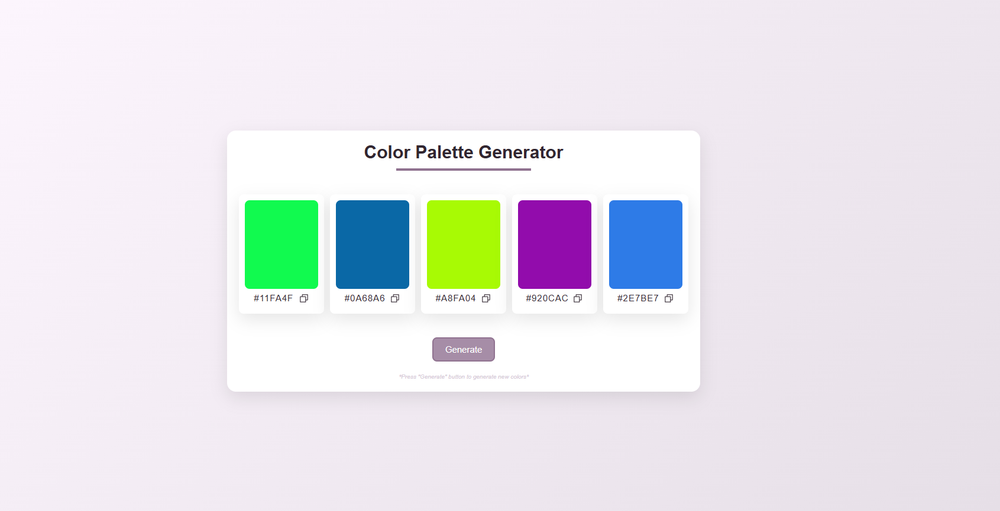

# 🎨 Color Palette Generator App

A simple and interactive web application that generates random color palettes and allows users to copy hex color codes to the clipboard with a visual confirmation.

## ✨ Features

- ✅ Generate a new set of 5 random colors.
- ✅ View the hex code for each color.
- ✅ Click on a color block or copy icon to copy the hex code to your clipboard.
- ✅ Visual feedback with an icon change when the code is copied.

## 📸 Screenshot

## 🛠️ Technologies

- HTML5
- CSS
- JavaScript (Vanilla)

## 🔧 How to Use

1. Clone the repository or download the ZIP.
2. Simply open `index.html` in any modern web browser. - No build steps or server needed!
3. On page load or clicking the "Generate" button, 5 new hex colors are generated.
- Each color is shown as a block with its hex code and a copy icon.
- Clicking a color or the icon, copies the hex code to your clipboard.
